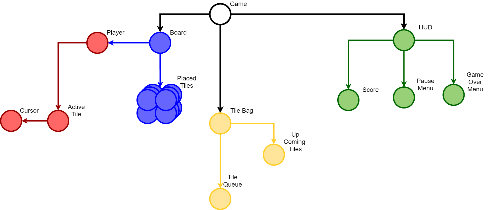

# Knotris

Knotris is a Mosaic Knot Tile game being developed to make it easier and more entertaining to study knot mosaics.

The following is the result of an [CURM](http://urmath.org/curm/) sponsored undergraduate research project conducted by Dr. Allison Henrich, Alexandra Ionescu, Brooke Mathews, Isaac Ortega, and Kelemua Tesfaye in the 2019-20 academic year.

When we began our research we thought we were going to work on pure math research (you know, making conjectures, proving theorems, and such). Our work was meant to involve the study of knot mosaics. Knot mosaics were first introduced by Lomonaco and Kauffman in 2008 [LomKau] in order to build a quantum knot system. But these interesting objects attracted a lot of interest in the math community, not necessarily because of their applications in quantum knot theory, but because they’re interesting combinatorial objects to play with and ask questions about.

In trying to formulate some new questions about knot mosaics and consider strategies for finding their answers, our team took some time to play. We were able to get our hands on a big bag of woodcut mosaic tiles made by Lew Ludwig for the UnKnot Conference, and we made some of our own. So, for several weeks in the fall, we would spend a part of our research time physically playing with these tiles to build intuition and formulate questions. One day, as we were talking about some potential research questions and playing idly with our tiles—trying to make collections of tiles be suitably connected—we realized that this simple act was actually pretty fun. “If we think putting together tiles in a suitably connected way is fun, maybe others would too!” “What if we created a game—kind of like Tetris—that used knot mosaic tiles instead of tetrominoes?” [TETRIS] And that was how our project was born. We dabbled in our pure math research and associated programming projects for several weeks after this idea came about, but quickly, it became clear to us that working to develop Knotris should be our new goal.

## Knotris Node Architecture

Knotris was developed using the [Godot Open Source Game Engine](https://godotengine.org/). The following is an architecture diagram of Knotris' node tree:

To edit this architecture open the file `diagrams/knotris_node_architecture.drawio` with [diagrams.net](https://www.diagrams.net/) and export both the new `.drawio` file and `.png` to this repository in the `diagrams` directory.

## Special Thanks

- Dr. Allison Henrich for supporting and leading the team through this project!
- Seattle University [Math Department](https://www.seattleu.edu/scieng/math/) for being awesome!
- [CURM](http://urmath.org/curm/) for sponsoring the research that made this project possible. (DMS-1722563)
- Nyall "[DnYaLL](https://soundcloud.com/nyall-padre)" Padre for providing the spicy in game music.
